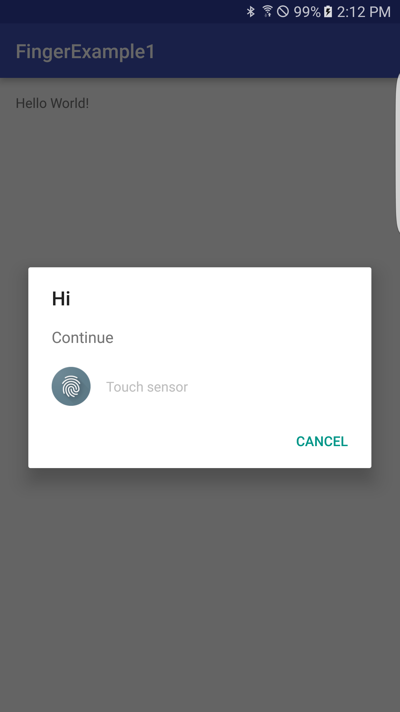

FingerprintDialog
===============================
Fingerprint dialog library for Android. (Marshmallow or higher)

### How to use
1.build.gradle in Project

<pre>repositories {
    jcenter()
}
</pre>
2.build.gradle in app

<pre>dependencies {
    compile 'salmon.tuna.brandon:fingerprint-authentication-dialog:1.0.4'
}
</pre>
3.Your activity

        if(Build.VERSION.SDK_INT >= Build.VERSION_CODES.M) {
            final FingerprintDialog.Builder builder = new FingerprintDialog.Builder(YourActivity.this);
            builder.setNegativeButton("Cancel");
            builder.build("Hi", "Continue", new FingerprintCallback() {
                @Override
                public void onAuthenticated() {
                    // To do...
                }

                @Override
                public void onError(int msgId) {
                    if (msgId == FingerprintManager.FINGERPRINT_ERROR_LOCKOUT) {
                        // To do...
                    } else if(msgId == FingerprintManager.FINGERPRINT_ERROR_CANCELED) {
                        // To do...
                    } else if(msgId == FingerprintManager.FINGERPRINT_ERROR_TIMEOUT) {
                        // To do...
                    } else {
                        //........
                    }

                }
            });
            builder.show();
        }
### Screenshot

